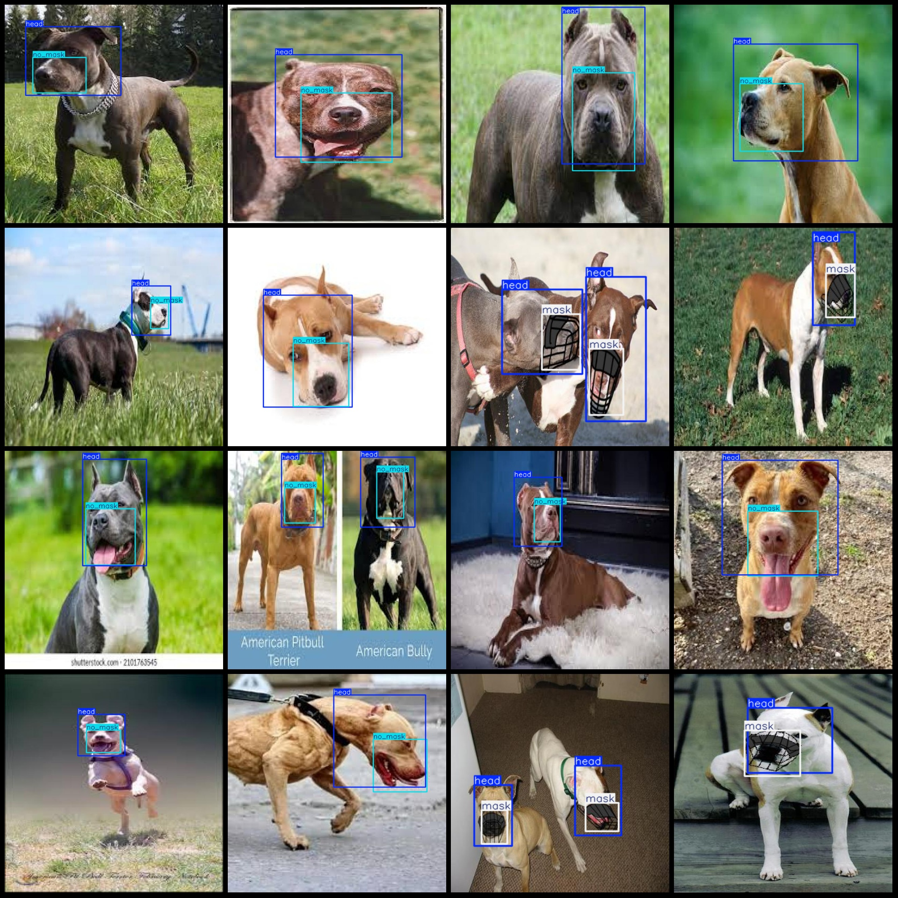
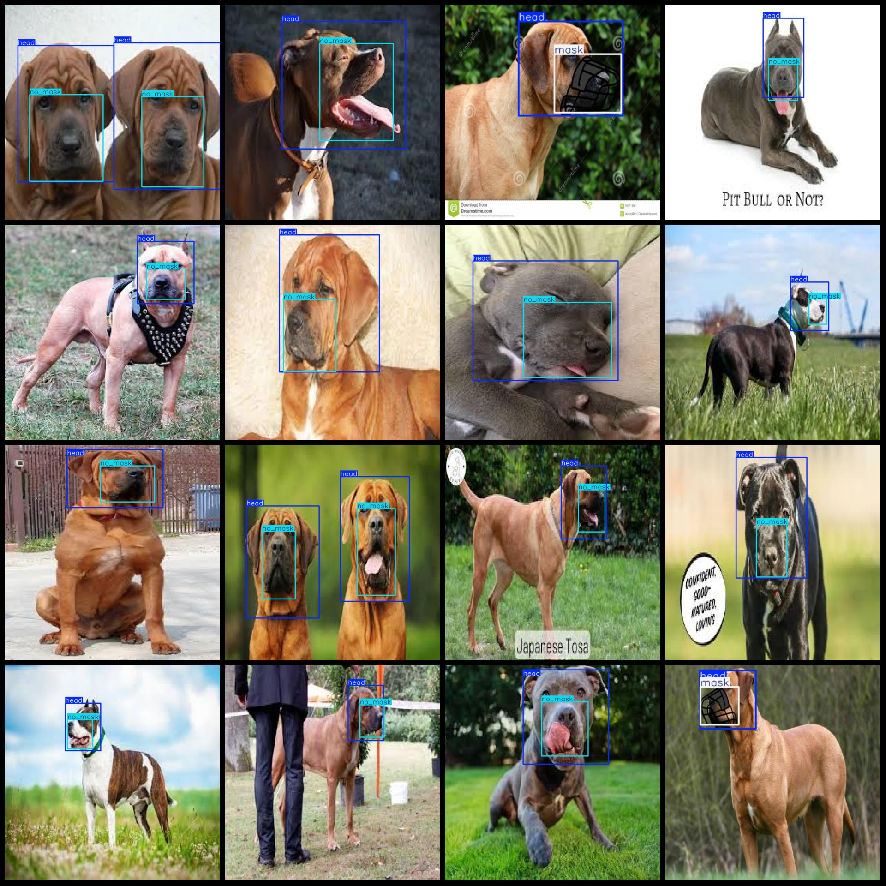

# Dog Breeds Detection Dataset: Pascal VOC + YOLO Format (1483 Images, 3 Classes)

Dataset format: Pascal VOC format + YOLO format (txt files without split path, only containing jpg images, VOC-formatted xml files, and YOLO-formatted txt files).
Number of images (jpg file count): 1483
Number of annotations (xml file count): 1483
Number of annotations (txt file count): 1483
Number of annotation categories: 3
Annotation category names (note that the order in the YOLO-format categories does not correspond to this, but is based on the 'labels' folder's 'classes.txt'): ["head", "mask", "no_mask"]
Number of bounding boxes for each category:
- head (dog head) = 1684
- mask (with mouth guard) = 288
- no_mask (without mouth guard) = 1394
Total bounding boxes: 3366
Number of images per category:
- head (dog head) = 1478
- mask (with mouth guard) = 276
- no_mask (without mouth guard) = 1203
Image resolution: Multiple resolution images, such as 416x416, 640x640, etc.
Annotation tool used: labelImg
Annotation rules: Draw a rectangular box around the category.
Important note: The dataset does not have separate training/validation/test sets; it needs to be divided by the user.
Special declaration: This dataset does not guarantee any accuracy of the trained models or weight files.
Image preview:
Annotation example:

## Image

Here is a pay link on Stripe ( https://buy.stripe.com/3cs8yP7sY87d0vu9AB ). Please contact me lonlonago@foxmail.com after funding $89, and I will send you a complete data files , thank you!

